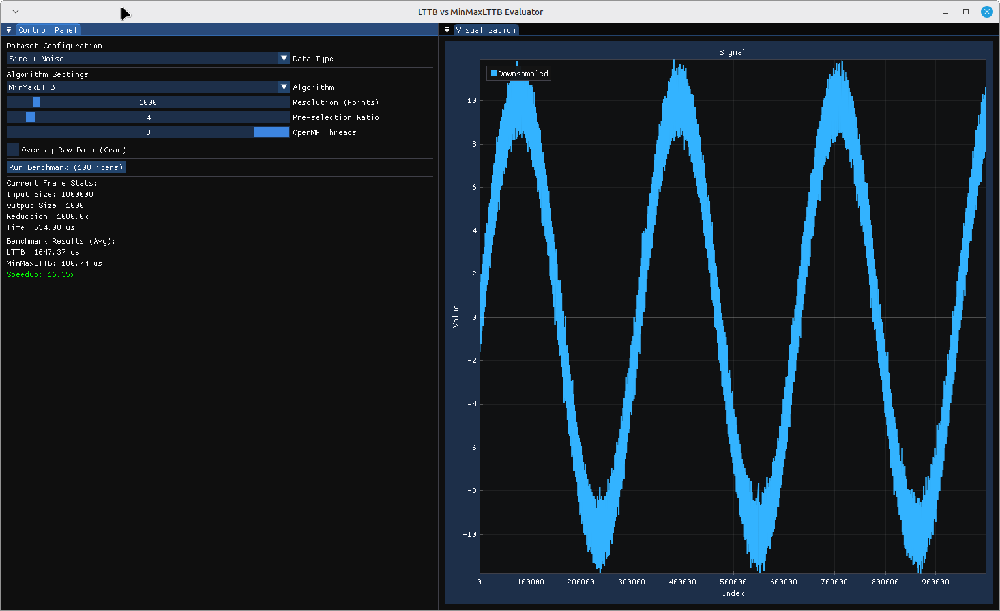

# LTTB vs. MinMaxLTTB performance and visual fidelity evaluation

This repository contains a C++ benchmarking and visualization tool designed to compare the standard **Largest-Triangle-Three-Buckets (LTTB)** downsampling algorithm against an optimized variation, **MinMaxLTTB**.

See https://github.com/predict-idlab/MinMaxLTTB.

Tested on a machine:

        CPU: 16-core AMD Ryzen Threadripper PRO 5955WX s (-MT MCP-)
        speed/min/max: 1927/1800/7033 MHz Kernel: 6.8.0-100-generic x86_64 Up: 1h 40m
        Mem: 11.71/125.61 GiB (9.3%) Storage: 10.48 TiB (14.5% used) Procs: 706

Results:

        [MinMaxLTTB] OpenMP Active: 8 threads.

        Benchmark Results (Avg):
        Dataset: Sine + Noise
        LTTB: 1651.22 us
        MinMaxLTTB: 118.27 us
        Speedup: 13.9614x

        Benchmark Results (Avg):
        Dataset: Brownian Motion
        LTTB: 1640.12 us
        MinMaxLTTB: 101.83 us
        Speedup: 16.1065x

        Benchmark Results (Avg):
        Dataset: Impulse Spikes
        LTTB: 1645.32 us
        MinMaxLTTB: 88.38 us
        Speedup: 18.6164x

## Overview

The application generates large synthetic datasets (1,000,000 points) and renders them using an interactive dashboard. It allows users to switch between algorithms, adjust downsampling parameters, and view real-time performance metrics.

### Algorithms Implemented
1.  **LTTB (Standard):** A downsampling algorithm that tries to preserve the visual shape of a trend by selecting points that form the largest triangles with adjacent buckets.
2.  **MinMaxLTTB (Optimized):** A two-stage algorithm designed for high performance on large datasets:
    *   **Stage 1 (Pre-selection):** Divides the data into buckets and selects the Minimum and Maximum values from each. This stage is parallelized using **OpenMP** and vectorized using **AVX2** intrinsics.
    *   **Stage 2 (Refinement):** Runs the standard LTTB algorithm on the significantly reduced dataset from Stage 1.

## Features
*   **Synthetic Data Generation:**
    *   Sine Wave + Gaussian Noise
    *   Brownian Motion
    *   Impulse Spikes (to test outlier preservation)
*   **Interactive UI:** Built with **Dear ImGui** and **ImPlot**.
    *   Real-time toggling of algorithms and datasets.
    *   Adjustable target resolution and pre-selection ratios.
    *   Dynamic thread count adjustment for OpenMP.
*   **Benchmarking:** Automated mode to run 100 iterations and calculate average execution time and speedup factors.

## Dependencies
*   **GLFW:** For window creation and input handling.
*   **Dear ImGui:** For the immediate-mode user interface.
*   **ImPlot:** For high-performance plotting within ImGui.
*   **OpenMP:** For multi-threading support in the MinMaxLTTB algorithm.
*   **OpenGL:** Rendering backend (OpenGL 3.0+).
*   **AVX2 Support:** (Optional but recommended) For SIMD optimizations in the pre-selection phase.
